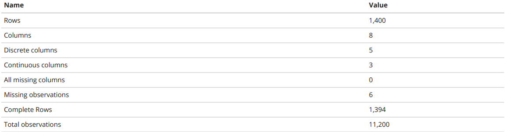
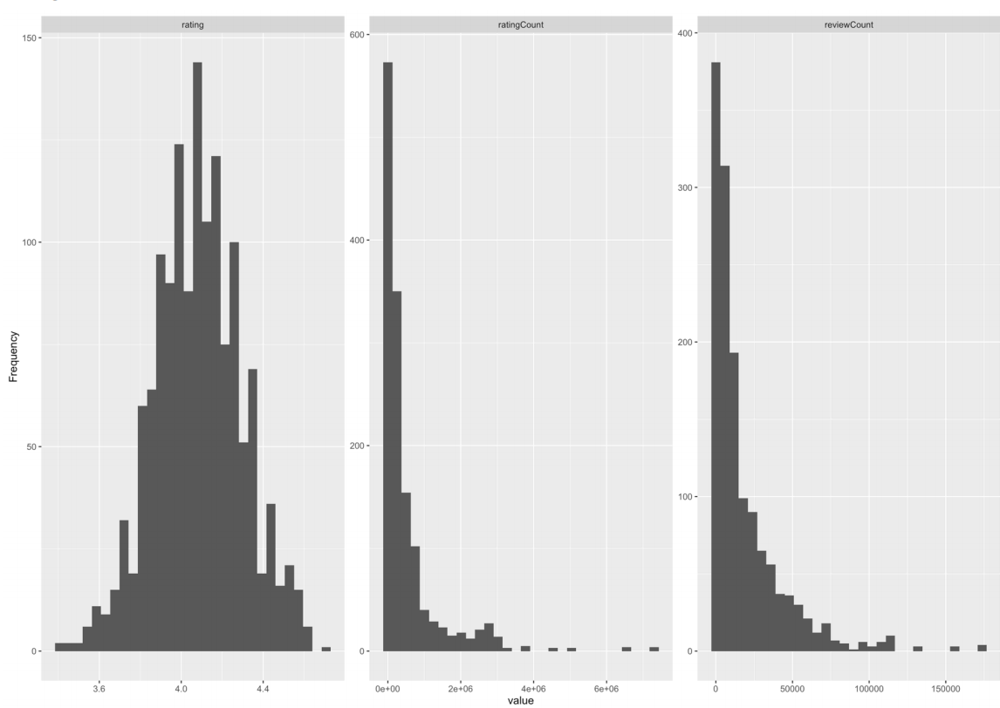
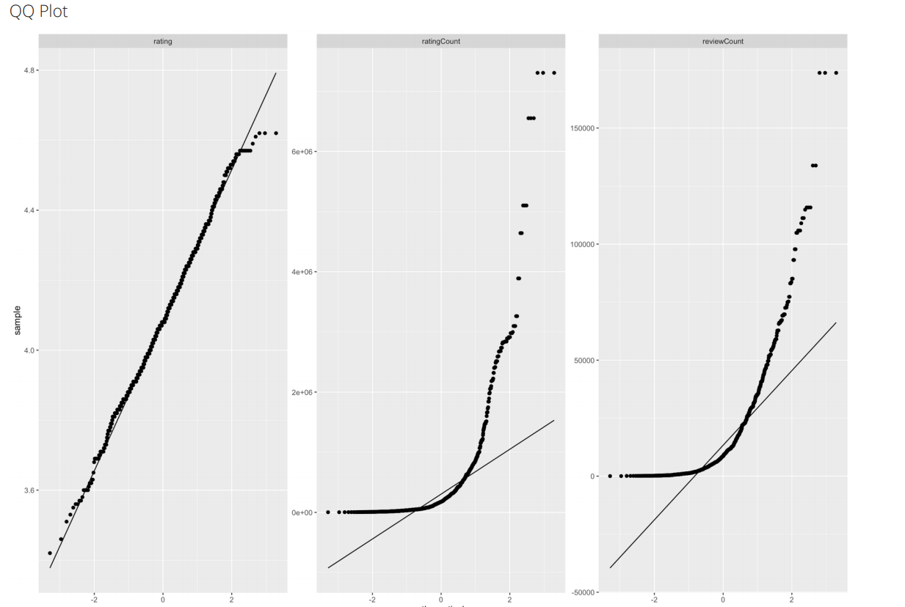
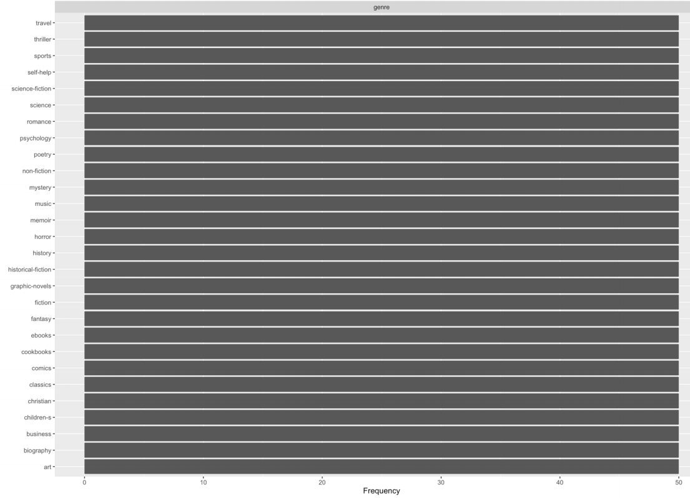

```{r setup, include=FALSE}
knitr::opts_chunk$set(echo = TRUE)
library(ggplot2)
library(DataExplorer)
library(corrplot)
library(RColorBrewer)
library(tidyverse)
#setwd("path\to\working\directory")

fdata = read_csv("data/books.csv")


#DataExplorer::create_report(fdata)
```

\newpage

 La intención de este informe es mostrar cómo realizar en RMarkDown un análisis exploratorio simple de las variables de un dataset utilizando diversos paquetes de R, tanto algunos que nos ayudan en las distintas representaciones estadísticas como otros paquetes existentes en R que te generan informes aleatorios.

 Este análisis exploratorio podría ser un ejemplo para realizar la práctica final de esta asignatura, complementando las técnicas y herramientas de esta asignatura con Probabilidades Condicionadas, Test de Hipótesis...

\newpage

# Descripción del conjunto de datos
 El set de datos a tratar consta de información sobre libros, recopilados de la página de [Goodreads](https://www.goodreads.com/), utilizando técnicas de *WebScrapping*.
   
 El set de datos contiene información tal como el título del libro, su género o su rating.
 Las variables de este conjunto de datos son:
 
 * title - Título del libro
 
 * author- Autor del libro
 
 * description - Sinopsis del libro
 
 * rating - Valoración del libro
 
 * ratingCount - Número de usuarios que han valorado el libro
 
 * reviewCount - Número de usuarios que han opinado sobre el libro
 
 * genre - Género del libro
 
 * book_link - URL de donde se ha extraido la información del libro
 

```{r}
summary(fdata)
```

```{r}
dim(fdata)
```
 De esta forma, contamos con un set de datos de 1400 filas y 8 columnas.
 
 Coprobemos si hay nulos en el set de datos:
 
```{r}
all(complete.cases(fdata))
```
 No tenemos ningún nulo en nuestro dataset, así que no tendremos que preocuparnos de trabajar con este tipo de valores.
 
 El posible conocimiento extraído de este conjunto de datos podría ser:  
 
 * La variación del rating de los libros según sus autores o géneros
 
 * Cómo varía la interactuación de los libros dependiendo de sus características 
 
 * ...  

\newpage

# Herramientas utilizadas
## R + RStudio: 
  R es un lenguaje y entorno de trabajo para computación estadística. Este lenguaje se ha utilizado trabajando sobre el IDE de RStudio. 

## ggplot2:
  Paquete de visualización de datos sobre R utilizado para representaciones gráficas realizadas sobre el set de datos.

## DataExplorer
 Paquete de automatización del proceso de exploración de datos utilizado para crear un informe básico sobre información tanto univariante como multivariante.

## corrplot
 Paquete de R para la representación gráfica de la matriz de correlación.

## RColorBrewer
 Paquete de R para la modificación de colores en las estructuras de las figuras.

## Tidyverse
 Colección de paquetes de R utilizados para *Data Science*.

\newpage

# Procesamiento previo de los datos

 Primero de todo, para este análisis exploratorio de nuestro dataset de libros, hemos de considerar que las columnas de las URLs y las sinopsis no nos proporcionan ningún tipo de información estadística que necesitemos para este proceso, por lo que las vamos a eliminar. Además, también es conveniente trabajar con factores en vez de Strings, proporcionándonos la posibilidad de agrupar según los autores o los géneros de los libros.

```{r}
fdata = fdata[,c(1,2,4,5,6,7)]
fdata[,c(2,6)] = lapply(fdata[c(2,6)], factor)
dim(fdata)
```
 
 Ahora el set de datos ya está preparado para ser utilizado
 
```{r}
glimpse(fdata)
```
 
\newpage

# Exploración univariante

 La exploración de los datos comienza con un análisis univariante de las variables, en el que principalmente se identifica una estructuración básica de éstas. Además de la información de las variables mostrada en el apartado primero se representa gráficamente los datos, tal como se muestra en los ejemplos de la siguiente figura, con los histogramas de las variables continuas:  
   
 
 Podemos conocer la normalidad de los datos observando la estructura de los histogramas o también con los qq-plot de estas variables:  
   
 
 Observando estos pares de gráficas llegamos a un análisis claro sobre estas variables. El rating sigue claramente una distribución normal, tal como se puede tanto apreciar en su histograma como en la representación del qqplot.
 
 Por otro lado, la asimetría de ambas variables "count" nos demuestra lo poco que los usuarios deciden valorar un libro o hacer comentarios del mismo.
 
 Además, también podemos ver la distribución de alguna de las variables discretas. En el caso de los títulos, es obvio que la distribución será de 1 elemento por cada libro, pero podemos mostrar la de los géneros de los mismos
 
 
 En este caso, nos enfrentamos a un dataset con una distribución de los géneros totalmente uniforme: 50 muestras por cada uno.

# Exploración multivariante

 Primero de todo, vamos a intentar describir la relación entre variables continuas, representado de forma gráfica las correlaciones entre ellas:
```{r echo=FALSE}
M <-cor(fdata[,c(3,4,5)])
corrplot(M, type="upper", order="hclust",
         col=brewer.pal(n=8, name="RdYlBu"))
```
 
 Como se puede observar, existe una alta correlación entre las variables de **ratingCount** y **reviewCount**. Probablemente sea porque la gente que está dispuesta a valorar un libro con una puntuación, también sea más favorable a opinar de forma abierta sobre el mismo.
 
 Por otro lado, también se puede intentar prever una relación entre alguna variable continua y discreta. Un ejemplo claro de esto sería cómo varía el rating según los distintos géneros existentes
 
```{r}
filtered_genres = fdata %>% 
  filter(genre %in% c('fantasy','fiction','cookbooks','art','science','sports'))

ggplot(filtered_genres, aes(x = genre, y = rating)) +
  geom_boxplot(fill = "#4271AE", colour = "#1F3552", alpha = 0.5, outlier.colour = "#1F3552", outlier.shape = 20) +
  scale_x_discrete(name = "Genre") +
  scale_y_continuous(name = "Rating") +
  ggtitle("Distribución de los ratings según el género del libro") + 
  theme_minimal()

```

Como nos muestra la figura, parece ser que los libros de ficción tienen mejor cabida en los lectores que los otros mostrados. Esta representación podría extrapolarse para ver la relación entre todas las variables continuas y discretas, como las utilizadas en este ejemplo.


\newpage

# Conclusiones

 Con las figuras obtenidas en este informe, podemos tanto conocer las distribuciones como las relaciones existentes en nuestras variables. Utilizando este conocimiento, podremos afrontar un análisis más profundo de todas sus variables, analizando la relación entre las variables, filtrado de las mismas, o el uso de probabilidades condicionadas para conocer ciertas tendencias en el set de datos.
 
 Además, mediante el uso de test de hipótesis podremos comprobar si nuestras primeras hipótesis eran ciertas, y mediante el uso de modelos de regresión podremos intentar predecir datos como el rating de un libro según el resto de información de la que dispongamos.
