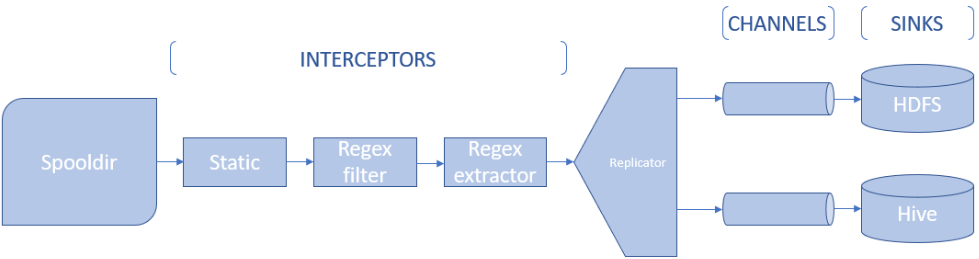

 # Tecnologías de Procesamiento Big Data
 
 ## Enunciado
 
 Tras haber realizado la ingesta de datos desde la página de goodreads, ahora tenemos que integrar dentro de nuestro cluster toda la información obtenida. 

 Para ésto lo que vamos a hacer es configurar un **Agente de Flume** cuyo objetivo sea coger los archivos desde un directorio del Edge, añadir los metadatos correspondientes y filtrar la información adquirida, para acabar integrando los datos en el cluster.

 En concreto, los pasos a realizar serán los siguientes:
 
 **SOURCE**
 
 Coger todos los archivos que estén en un directorio en concreto de nuestro usuario que acaben por '.csv'.
 

 **INTERCEPTORS**
 
 1. Añadir una cabecera estática con el origen de nuestros datos ('goodreads').
 2. Eliminar todas las líneas que tengan la palabra 'ebook', dado que no es un género real y no nos interesa para los análisis posteriores.
 3. Extraer el campo de 'genre' de cada línea y añadirla como metadatos de la cabecera para el posterior particionamiento de la tabla en Hive.
 
 **REPLICATING**
 
 Habrá que configurar un Selector que envíe los datos a dos fuentes distintas, según la utilidad que se le vaya a dar a los datos.
 
 **CHANNELS**
 
 Elección libre
 
 **SINKS**
 1. HDFS (en el directorio './flume_data/CABECERA_ESTÁTICA')
 2. Hive (a una tabla llamada 'goodreads_flume')
 
 De forma que el agente de Flume seguirá un esquema como el siguiente:
 
 
 
 ***

 ## Agente
 
> #FLUME AGENT - Practica FLUME - Beltran Rodriguez-Mon
> 
> ##Flume agent elements
> 
> brodriguez.sources = spoolsource
> brodriguez.channels = channel1 channel2
> brodriguez.sinks = hdfs_sink hive_sink
>  
> ##Source configuration
> 
> brodriguez.sources.spoolsource.type = spooldir
> brodriguez.sources.spoolsource.spoolDir = /home/alumnos18/brodriguez/input
> brodriguez.sources.spoolsource.includePattern = .+(\.csv)
> 
> ##Interceptors
> 
> brodriguez.sources.spoolsource.interceptors = staticInterceptor filterRegexInterceptor extractorRegexInterceptor
> 
> ##Static Interceptor configuration 
> 
> brodriguez.sources.spoolsource.interceptors.staticInterceptor.type = static
> brodriguez.sources.spoolsource.interceptors.staticInterceptor.key = source
> brodriguez.sources.spoolsource.interceptors.staticInterceptor.value = GoodReads
> 
> ##Regex Filter Interceptor configuration 
> 
> brodriguez.sources.spoolsource.interceptors.filterRegexInterceptor.type = regex_filter
> brodriguez.sources.spoolsource.interceptors.filterRegexInterceptor.regex = ^((?!ebooks).)*$
> 
> ##RegexExtractor Interceptor configuration 
> 
> brodriguez.sources.spoolsource.interceptors.extractorRegexInterceptor.type = regex_extractor
> brodriguez.sources.spoolsource.interceptors.extractorRegexInterceptor.regex = FALTA_REGEX_GENRE
> brodriguez.sources.spoolsource.interceptors.extractorRegexInterceptor.serializers = s1
> brodriguez.sources.spoolsource.interceptors.extractorRegexInterceptor.serializers.s1.name = g
> 
> ##Replicator configuration
> 
> brodriguez.sources.spoolsource.selector.type = replicating
> brodriguez.sources.spoolsource.channels = channel1 channel2
>  
> ##Channel1 configuration
> 
> brodriguez.channels.channel1.type = memory
> brodriguez.channels.channel1.capacity = 100000
> brodriguez.channels.channel1.transactionCapacity = 1000
>  
> ##Channel2 configuration
> 
> brodriguez.channels.channel2.type = memory
> brodriguez.channels.channel2.capacity = 100000
> brodriguez.channels.channel2.transactionCapacity = 1000
>  
> ##HDFS Sink configuration 
> 
> brodriguez.sinks.hdfs_sink.type = hdfs
> brodriguez.sinks.hdfs_sink.hdfs.path = hdfs://nameservice1/user/brodriguez/flume_data/%{filetype}
> brodriguez.sinks.hdfs_sink.hdfs.fileType = DataStream
> brodriguez.sinks.hdfs_sink.hdfs.writeFormat = Text
> brodriguez.sinks.hdfs_sink.hdfs.batchSize = 1000
> brodriguez.sinks.hdfs_sink.hdfs.rollSize = 0
> brodriguez.sinks.hdfs_sink.hdfs.rollCount = 1000
> brodriguez.sinks.hdfs_sink.hdfs.rollInterval = 50
> brodriguez.sinks.hdfs_sink.hdfs.useLocalTimeStamp = true
> 
> ##Hive Sink configuration 
> 
> brodriguez.sinks.hive_sink.type=hive
> brodriguez.sinks.hive_sink.hive.metastore=thrift://master02.bigdata.alumnos.upcont.es:9083
> brodriguez.sinks.hive_sink.hive.database=brodriguez
> brodriguez.sinks.hive_sink.hive.table=goodreads_flume
> brodriguez.sinks.hive_sink.hive.partition=%{g}
> brodriguez.sinks.hive_sink.serializer=DELIMITED
> brodriguez.sinks.hive_sink.serializer.delimiter=;
> brodriguez.sinks.hive_sink.serializer.fieldnames=title,author,description,rating,ratingCount,reviewCount,genre,book_link
> 
> ##Channels binding
> 
> brodriguez.sources.spoolsource.channels = channel1 channel2
> brodriguez.sinks.hdfs_sink.channel = channel1
> brodriguez.sinks.hive_sink.channel = channel2

 ***
 
 ## Tabla Hive
 
> CREATE TABLE brodriguez.goodreads_flume
> (
> 	title STRING,
> 	author STRING,
> 	description STRING,
> 	rating INT,
> 	ratingCount INT,
> 	reviewCount INT,
> 	book_link STRING,
> )
> PARTITIONED BY (g STRING)
> STORED AS ORC;